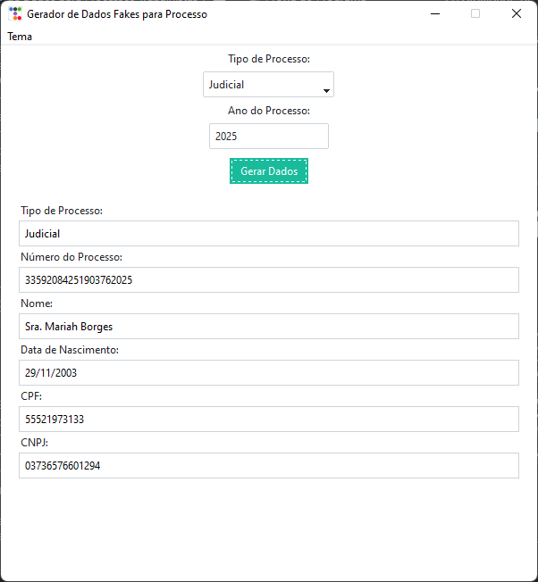
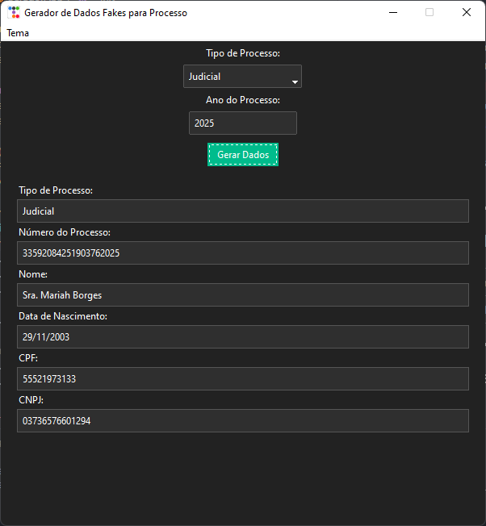

# 🧾 Gerador de Dados para Processos Trabalhistas

Um aplicativo Python com interface gráfica moderna para gerar **dados fictícios de processos trabalhistas**, útil para testes, preenchimentos simulados e demonstrações. Ideal para profissionais de QA, advogados, ou desenvolvedores que trabalham com sistemas jurídicos ou de recursos humanos.

---

## 📌 Funcionalidades

- Geração aleatória de:
  - Número de processo (15 ou 20 dígitos, conforme tipo)
  - Nome completo
  - Data de nascimento
  - CPF válido
  - CNPJ válido
- Seleção entre:
  - **Processo Judicial** (20 dígitos)
  - **Demanda CCP/NINTER** (15 dígitos)
- Campo de **ano do processo** com validação numérica
- Tema **claro e escuro**
- Possibilidade de **copiar informações individualmente** (Ctrl+C ou botão direito)
- **Histórico automático** de dados gerados (backup por data ao fechar o programa)

---

## 🎥 Prévia do Programa

| Tema Claro | Tema Escuro |
|------------|-------------|
|  |  |
---

## 🚀 Tecnologias Utilizadas

- Python 3.10+
- `tkinter` para interface gráfica
- `ttkthemes` para temas modernos
- `Faker` para gerar dados fake
- `validate-docbr` para CPF e CNPJ válidos

---

## 🛠️ Instalação

### 1. Clone o repositório

```bash
git clone https://github.com/seu-usuario/Gerador-Processo.git
cd Gerador-Processo
