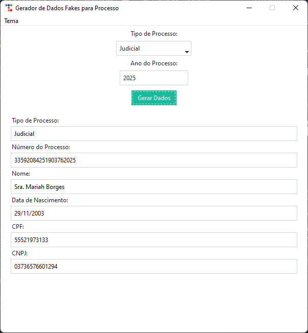
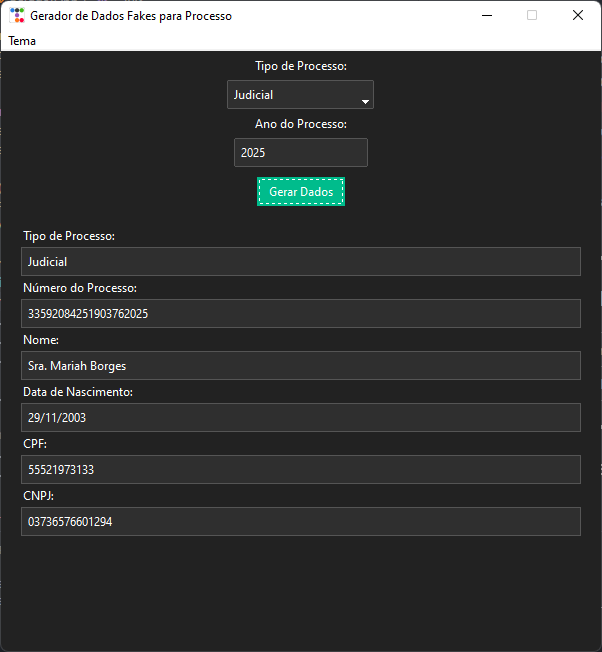

# 🧾 Gerador de Dados para Processos Trabalhistas

Aplicativo em Python com interface gráfica moderna para gerar **dados fictícios de processos trabalhistas**, ideal para testes QA, automações, simulações e demonstrações.
O projeto possui dois geradores: um simples para uso rápido e outro avançado com geração em lote e exportação CSV.

---

## 📌 Funcionalidades

### 🧩 Gerador Individual (`gera_processo`)

* Geração aleatória de:

  * Número de processo (15 ou 20 dígitos, conforme tipo)
  * Nome completo (sem prefixos como Dr., Sr., etc.)
  * Data de nascimento
  * CPF válido
  * CNPJ válido
* Seleção entre:

  * **Processo Judicial** (20 dígitos)
  * **Demanda CCP/NINTER** (15 dígitos)
* Campo de **ano do processo** com validação numérica
* Tema **claro e escuro**
* Botão 📋 para copiar rapidamente cada campo
* Menu de cópia via botão direito ou Ctrl+C
* **Backup automático** dos dados gerados ao fechar o programa

---

### 🚀 Gerador em Lote (`gera_processo_csv`)

* Geração massiva de registros trabalhistas
* Exportação automática para `.csv`
* Campos compatíveis com JSON para uso em Postman
* Datas eSocial geradas automaticamente (dtSent, dtDeslig, dtRemun)
* Labels amigáveis na interface (ex: Nº do Processo), mantendo as chaves técnicas internas
* Período de apuração fixo ou aleatório
* Scroll dinâmico para visualização dos registros
* Botão 📋 para copiar valores individualmente

---

## 🎥 Prévia do Programa

| Tema Claro | Tema Escuro |
|------------|-------------|
|  |  |

### Gera Processo CSV


---

## 🚀 Tecnologias Utilizadas

* Python 3.10+
* `tkinter` / `ttkbootstrap` para interface gráfica moderna
* `Faker` para geração de dados fictícios
* `validate-docbr` para geração de CPF e CNPJ válidos
* `PyInstaller` para geração dos executáveis

---

## 🛠️ Instalação

### 1️⃣ Clone o repositório

```bash
git clone https://github.com/seu-usuario/Gerador-Processo.git
cd Gerador-Processo
```

---

### 2️⃣ Instale as dependências

```bash
pip install -r requirements.txt
```

---

### 3️⃣ Execute o projeto

Gerador individual:

```bash
python gera_processo.py
```

Gerador em lote:

```bash
python gera_processo_csv.py
```

---

## 📦 Download do Executável (.exe)

Se você deseja apenas utilizar o programa, não é necessário instalar Python ou compilar o projeto.

👉 Acesse a página de **Releases** do repositório e baixe a versão mais recente:

- `gera_processo.exe` → Gerador individual de dados
- `gera_processo_csv.exe` → Gerador em lote com exportação CSV

Após o download:

1. Extraia os arquivos (se estiverem compactados).
2. Execute o `.exe` desejado.
3. Utilize normalmente — não requer instalação.

> 💡 As versões disponibilizadas na página de Releases já estão prontas para uso em ambiente Windows.

---

## 🎯 Casos de Uso

* Testes QA em integrações trabalhistas
* Geração de massa para Postman
* Demonstrações de sistemas jurídicos
* Simulação de dados em ambientes de homologação

---

## 🔄 Changelog

### v1.1.0

* Novo gerador em lote com exportação CSV
* Botões 📋 para cópia rápida
* Labels amigáveis na interface
* Remoção automática de prefixos nos nomes
* Melhorias de usabilidade e estabilidade

### v1.0.0

* Lançamento inicial do gerador individual

---

## ⚠️ Aviso

Os dados gerados são **100% fictícios** e destinados apenas para testes e demonstrações.
